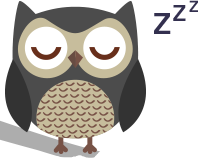

<p align="center">
  <a href="" rel="noopener">
 </a>
</p>

<h3 align="center">LazyAiOwl</h3>

<div align="center">

[]()
[](https://github.com/Mr-Wii/LazyAiOwl/issues)
[](https://github.com/Mr-Wii/LazyAiOwl/pulls)
[](/LICENSE)

</div>

---

<p align="center"> Your personal AI Gamer Friend
    <br> 
</p>

## 📝 Table of Contents

- [About](#about)
- [Getting Started](#getting_started)
- [Usage](#usage)
- [Build Using](#build_using)
- [TODO](#todo)
- [Authors](#authors)

## 🧐 About <a name = "about"></a>

Lazy AiOwl is an assistant with many possibilities.
The current features are : Search and instant answers, Search in wikipedia, Play a music.

See in-app commands list.

## 🏁 Getting Started <a name = "getting_started"></a>

These instructions will get you a copy of the project up and running on your local machine for development and testing purposes.

### Prerequisites

Please run this to setup the environement aswell as the packages

```
virtualenv -p /usr/local/bin/python2 venv
virtualenv venv
source venv/bin/activate
pip install -r PyRequirements.txt
```

### Installing

```
npm run-script build
```

## 🎈 Usage <a name="usage"></a>

Run this first

```
Py AiOwl.py true
```

Then

```
npm start
```

If you wanna execute it using the build folder run it without any argument

```
Py AiOwl.py
```

## ⛏️ Build Using <a name = "build_using"></a>

```
python -m eel AiOwl.py build --onefile --noconsole
```

## ✍️ TODO <a name = "todo"></a>

- Wake / sleep feature
- Volume control
- Learn and play a game
- Teach a game to the user
- Play games with the user

## ✍️ Authors <a name = "authors"></a>

- [@Ouail Bni aka Mr-Wii](https://github.com/mr-wii) - Idea & Initial work
